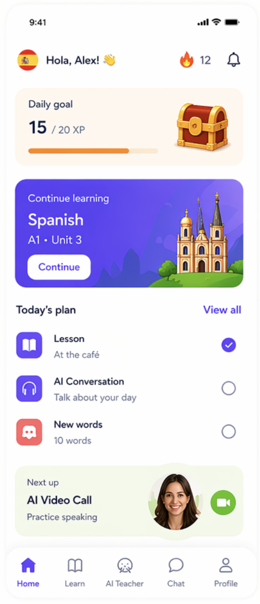

Read AGENTS.md first and follow it strictly.

Implement the Home screen UI exactly as shown in the attached design with spacing structure and such neatly exactly done. Display the logged-in user information from Clerk and the selected language from Zustand + AsyncStorage.

Use the learning data from `data/*` to show current lesson, progress, and today’s plan.

Use only bundled images from the assets folder through the centralized `images` import. Do not use Unsplash, Picsum, or any other remote image fallback. If a needed bundled image is unavailable, use a local placeholder asset exposed through `images`, or explicitly render the existing missing-asset state.

