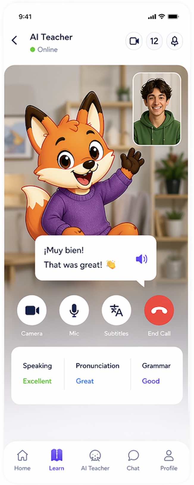

Read AGENTS.md first and follow it strictly.

Implement the AI Teacher audio lesson screen exactly as shown in the attached design. When the user taps any lesson from the Learn/Lessons screen, open this screen with the selected lesson id. Validate the route parameter and look up the lesson in the hardcoded learning data before rendering any lesson content or audio controls. If the id is missing, stale, or does not resolve to a lesson, render an error state with navigation back to Lessons. Only after the lookup succeeds should the screen render the selected lesson’s language, title, goal, phrases, AI teacher context, and audio controls.

This should be an audio-only experience. Do not implement video calling. Keep the camera area as a visual teacher preview/placeholder only if needed, and focus on audio lesson controls such as mic, subtitles, end call, lesson feedback, teacher response bubble, and session status.

Use assets from the assets folder via the centralized images import and keep everything consistent with the existing design system and bottom tab navigation.

